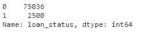

# Module 12 Challenge

## Credit Risk Classification Report

## Overview of the Analysis

- In this Challenge, machine learning models are applied to the provided data, and trained to predict credit risks.
- The inputs (features) are financial informations of the borrower: loan size, interest rate, borrower income, debt to income ratio, borrower's number of accounts, derogatory marks (negative items from credit report), total debt amount.
- The output (label) are whether the loan is a healthy loan (0) or a high risk loan (1).
- An analysis of various techniques is needed to evaluate their performance because credit risk poses a classification problem, being inherently imbalanced. Evidently, the healthy loans (0) outnumber risky loans (1) in our data set:

  

- Describe the stages of the machine learning process you went through as part of this analysis.
- The steps taken are:

  - Split the Data into Training and Testing Sets
  - Create a Logistic Regression Model with the Original Data
  - Predict a Logistic Regression Model with Resampled Training Data.

- Logistic regression models the probabilities for classification problems with two possible outcomes. It is appropriate to use this algorithm because the output is binary, being either a healthy loan (0) or a high risk loan (1).
- Due the imbalanced of the data set, random oversampling method is used to boost up the population of high risk loan (1) by randomly selecting examples from high risk loan (1), with replacement, and adding them to the training dataset.

## Results

Using bulleted lists, describe the balanced accuracy scores and the precision and recall scores of all machine learning models.

- Machine Learning Model 1:
  - Description of Model 1 Accuracy, Precision, and Recall scores.

- Machine Learning Model 2:
  - Description of Model 2 Accuracy, Precision, and Recall scores.

## Summary

Summarize the results of the machine learning models, and include a recommendation on the model to use, if any. For example:

- Which one seems to perform best? How do you know it performs best?

  - Model 2 performs better as it has higher recall, and higher f1 score.

- Does performance depend on the problem we are trying to solve? (For example, is it more important to predict the `1`'s, or predict the `0`'s? )
  - Yes.
  - In this case, it is more important for the model to predict the bad loan `1`'s because further checks can be done to confirm the loan is actually bad. The recall is calculated as the ratio between the number of Positive samples correctly classified as Positive to the total number of Positive samples. The recall measures the model's ability to detect Positive samples.
